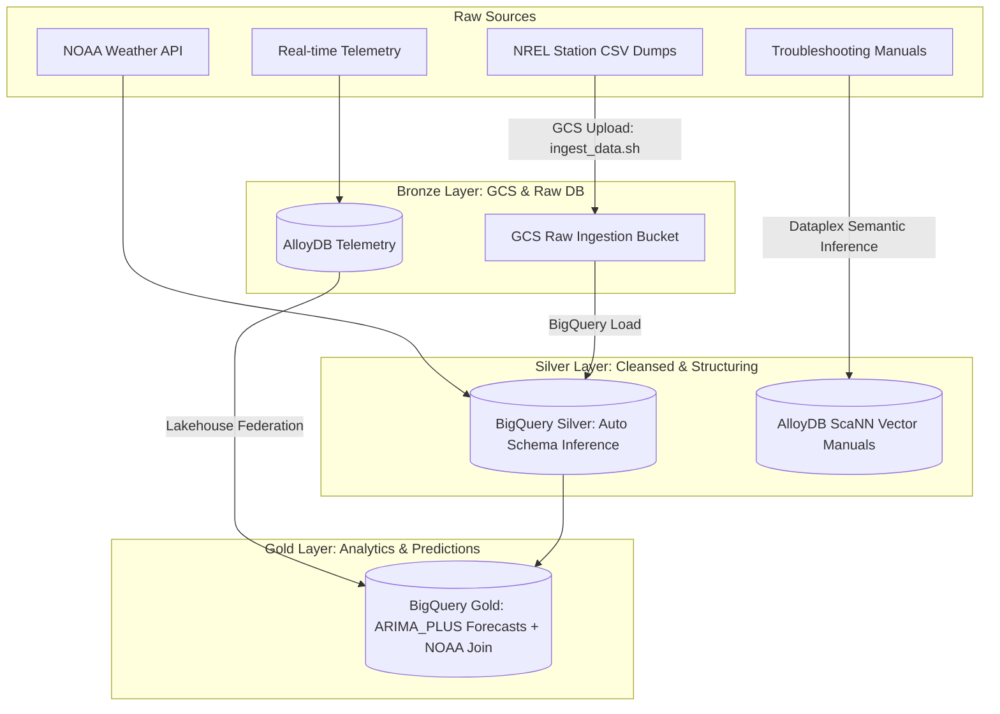

# EV-Charge AI Agent: MASTER PLAN

This document outlines the master development plan, system architecture, database schema, verification suite, and deployment steps for **EV-Charge**, a smart city EV charging infrastructure demand forecasting, routing, and troubleshooting decision platform.

---

## 1. Project Vision & Goals

**EV-Charge** is an intelligent decision platform for EV charging operators (SREs). It leverages Google Cloud technologies and Google's agentic framework (Google ADK + Gemini) to provide:
1. **Real-time Status Monitoring**: Instantly query status and troubleshoot malfunctioning chargers.
2. **Smart Troubleshooting (Semantic RAG)**: Utilize AlloyDB ScaNN vector search over technical manuals to retrieve actionable maintenance steps.
3. **Holiday Demand Forecasting & Routing**: Run time-series forecasting (BigQuery ML ARIMA_PLUS) to predict holiday charging congestion and guide load balancing.

---

## 2. Proposed Infrastructure Logic (Global Standard)

Our infrastructure design adheres to three core design pillars for global production standard:

*   **Zero-ETL Federation**: *"Integrating real-time telemetry from AlloyDB with historical BigQuery analytical datasets via Lakehouse Federation, enabling unified decision intelligence without massive ETL overhead."*
*   **Cost-Aware Lifecycle**: *"Our infrastructure is designed with a 'Cost-First' mandate, utilizing BigQuery Sandbox and AI Studio's complimentary tiers, with automated life-cycle management for operational databases to maintain a near-zero footprint in non-active testing windows."*
*   **Safety-by-Design**: *"The agent's decision-making loop is constrained by a 'Human-in-the-loop' approval gate (Atomic conditional writes), and all tool execution paths are audited by the Gemini Agent Eval API to ensure 0% risk of prompt injection."*

---

## 3. System Architecture

The platform uses a **3-Tier Architecture** designed for high reliability, fast local verification, and low-cost deployment:

```mermaid
graph TD
    UI[Web UI Dashboard: templates/index.html] <--> |REST API| App[Flask Server: agent.py]
    App <--> |Google ADK / Gemini 3.5 Flash| Model[Vertex AI / Gemini API]

    subgraph GCP Environment (Unified Lakehouse)
        App <--> |SSE Transport| MCP[Cloud Run MCP Database Toolbox]
        MCP <--> |AlloyDB Access| AlloyDB[(AlloyDB: live_charger_status, ev_charger_manuals)]
        MCP <--> |BigQuery API| BQ[(BigQuery: historical_charging_orders, BQML Model)]
        AlloyDB <--> |Lakehouse Federation / Zero-ETL| BQ
        App <--> |Human-in-the-loop Approval Gate| Firestore[(Firestore: Audit & Approval Logs)]
    end

    subgraph Local Sandbox (Instant Run-ability)
        App <--> |Stdio Transport| LocalMCP[Local Mock MCP: mcp_server_local.py]
        LocalMCP <--> |Local pgvector| PG[(Docker: PostgreSQL + pgvector)]
    end
```

### 3.1. Lakehouse Federation (Zero-ETL Querying)
By establishing a Federated Query link between AlloyDB and BigQuery, we unify transactional (OLTP) and analytical (OLAP) processing. AlloyDB real-time telemetry is queried alongside BigQuery's historical orders and forecasting results on-demand, eliminating latency-heavy ETL pipelines.

### 3.2. Human-in-the-loop (HITL) Safety Gate
For critical operations (e.g. system restarts or configuration changes), the Agent writes a pending request record to Firestore. A human operator must approve it before execution. This prevents prompt-injection attacks from triggering destructive actions on the physical chargers.

---

## 4. Data Strategy (Data Sources & Pipelines)

To deliver high-fidelity forecasting and troubleshooting, we employ a unified data lakehouse strategy structured around a **Bronze-Silver-Gold architecture**:



### 4.1. Data Ingestion Strategy: From Raw to Gold
*   **Raw Ingestion (Bronze)**: We ingest raw CSV/JSON dumps from NREL Alternative Fueling Stations and Open Charge Map into Google Cloud Storage (GCS), treating it as our 'Bronze' layer for immutable, raw historical records.
*   **Schema Evolution (Silver)**: Using BigQuery DataScan and auto-detection schemas, we automate schema inference to transform unstructured/semi-structured station metadata into a structured 'Silver' layer, ensuring strict data type enforcement.
*   **Semantic Enrichment (Gold)**: Finally, we join this station data with historical session logs and public weather datasets (NOAA) to create an enriched 'Gold' analytical layer, which powers our LLM-based agent with deep contextual understanding of charger performance and demand fluctuations under environmental/grid stress.

### 4.2. AlloyDB (Operational & Vector)
*   **Table `live_charger_status`**: Telemetry and error codes (`charger_id`, `status`, `current_load_kw`, `error_code`, `last_updated`).
*   **Table `ev_charger_manuals`**: Stores manual embeddings. Powered by **ScaNN IVFFLAT cosine similarity** for fast troubleshooting:
    ```sql
    SELECT section_title, troubleshooting_steps, error_code,
           1 - (embedding <=> embedding('text-embedding-004', $1)::vector) as similarity
    FROM ev_charger_manuals
    ORDER BY embedding <=> embedding('text-embedding-004', $1)::vector
    LIMIT $2;
    ```

### 4.3. BigQuery Public Datasets & External Data (Analytical)
*   **BigQuery Public Datasets (NOAA Weather & Grid Load)**: We query real-time weather and temperature datasets directly in BigQuery. Combining weather variables (e.g. extreme heat/cold) with charger loading logs allows the forecasting models to predict hardware failure rates.
*   **Data Pipelines (`scripts/ingest_data.sh`)**: The automated pipeline downloads the NREL CSV dataset, copies it to Google Cloud Storage, and loads it with schema auto-detection into BigQuery to keep the analytical base up to date.

---

## 5. Cost Optimization & Sustainability

We partition our environment lifecycle to keep infrastructure footprint low, balancing developers' budgets and production readiness.

### 5.1. Free-Tier & Prototype Phase (Zero Cost)
*   **Local Sandbox**: All database queries and vector searches run locally via Docker (`pgvector`) and local MCP simulations.
*   **BigQuery Sandbox**: Free monthly allocation (10 GB storage, 1 TB queries).
*   **Vertex AI / Google AI Studio Free Tiers**: Zero cost inference using Gemini 3.5 Flash for prototype evaluation.

### 5.2. Scaling & Production Phase (Operational Cost Protection)
*   **Cloud Run (Scale-to-Zero)**: The MCP Database Toolbox is configured with `--min-instances 0`. It scales down to zero when idle, avoiding continuous compute costs.
*   **AlloyDB Auto Start/Stop**: Scheduled scripts stop AlloyDB instances in non-testing hours to save up to 95% of vCPU/RAM billing:
    ```bash
    gcloud alloydb instances stop ev-charge-primary --cluster=ev-charge-alloydb-cluster --region=us-central1
    ```
*   **Partitioned Forecasting**: BigQuery ML model training is run on-demand (e.g. once a week) rather than per-query, and all queries enforce temporal partitioning to minimize TB scan billing.

---

## 6. Execution Commands & Run-ability

To ensure immediate **Run-ability** for judges and evaluators, the repository is configured to be cloned and tested offline in **one single command** without cloud dependencies:

### 6.1. Start Local Sandbox (Docker + Ingestion + Compilation Check)
```bash
# Spin up local vector database container:
docker-compose up -d

# Download and load NREL alternative fuels data & manual embeddings to PostgreSQL:
python3 scripts/load_data_local.py

# Verify code compiles & runs evaluation tests:
make check
```

### 6.2. Run Local Dashboard Server
```bash
# Start Flask backend using mock MCP Stdio connection:
python3 agent.py
```
Open `http://localhost:8080` to interact with the premium EV-Charge operator console.

### 6.3. GCP Deploy Cheat Sheet
```bash
# Deploy MCP Toolbox Cloud Run service:
./deploy.sh

# Manage AlloyDB instance state:
gcloud alloydb instances stop ev-charge-primary --cluster=ev-charge-alloydb-cluster --region=us-central1
gcloud alloydb instances start ev-charge-primary --cluster=ev-charge-alloydb-cluster --region=us-central1
```
