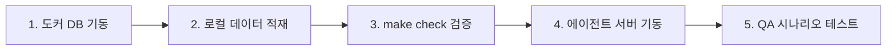

# EV-Charge 플랫폼: QA 테스트 가이드 (QA Test Guide)

이 문서는 **EV-Charge** 지능형 의사결정 에이전트, 데이터 파이프라인 및 로컬 데이터베이스의 작동 상태를 검증하기 위한 단계별 테스트 가이드입니다. 모든 테스트는 **비용이 전혀 발생하지 않는 100% 오프라인 로컬 샌드박스**에서 진행됩니다.

---

## 0. ⚡ 지금 체크할 것 — Smart-EV 신규 기능 (브라우저)

> 앱은 `python3 agent.py` 로컬 기동 중 → **http://localhost:8090** 접속(첫 진입 시 ⌘+R).
> 아래 [x] 항목은 **2026-06-29 Playwright 헤드리스로 자동 검증 완료**(페이지 에러 0).
> 사람이 최종으로 "느낌"·실데이터 적절성만 확인하면 됩니다.

**기본 화면**
- [x] 흰 화면 아님 — 헤더 "**Smart-EV Agent**" + KPI 5개(7,842 충전소 등) + 지도(충전소 클러스터)
- [x] 한국어 토글(우상단) → 전체 UI 한글 전환
- [x] 패널 접기/펴기

**추천 흐름**
- [x] `APAC 도시 선택`→Seoul → 차/위치 이동(차 마커)
- [x] **추천받기** → 추천 카드 6개 + 지도 경로선 + 채팅 응답·툴 트레이스 스트리밍

**🚗 주행+충전 시뮬레이션 (핵심)**
- [x] **▶ 주행 시뮬레이션** → **메인 지도 위 인라인 주행**(차가 경로 따라 실제 이동·카메라 추적) + 상단 HUD(▶⏸·TURBO·진행바)
- [x] HUD **🎬** 버튼 → 시네마틱 풀스크린 모달로 확장 (칩 🍴/🗺️은 기본 시네마틱)
- [x] 배터리 20%→**80%** 차오름, kW·경과시간 / **TURBO 1×/4×/16×** / ▶⏸
- [x] "충전하는 동안 할 거리" 식당 카드(평점·도보 분)

**🗺️ 다중 목적지 코스 (트립 모달 수정 반영)**
- [x] 경유지 2곳+ → **코스 계획 & 시뮬레이션** → 합계(km·분) + 모달 재생
- [x] 트립 모달: **"경로 주변 장소" POI 카드 표시** + **실제 배터리 %**(0% 버그 수정) + 트립 통계(거리/ETA/경유지)

**🤖 에이전트 스마트라이프 (칩 = 채팅 + 지도 + 시뮬 동시 구동)**
- [x] 칩 **🍴 점심** → (도시 미선택 시 Seoul 자동) 추천→경로선→메인 지도 POI 마커→주행+충전 시뮬
- [x] 칩 **🗺️ 쇼핑+저녁 코스** → 경유지 자동 구성 + 시뮬 + 메인 지도 POI
- [x] **메인 지도에 POI 마커**(충전소 외 식당/쇼핑/주차)

**🤖 에이전트 응답 → UI 카드 (신규)**
- [x] 자유 채팅으로 충전소 추천 요청 → **상단 고정 "⚡ 내 충전 계획" 카드** 생성
- [x] 카드가 **에이전트의 실제 선택을 반영**(예: 첫 충전소 만석 → 폴백 충전소) — 충전소명·거리·kW·실시간·충전시간·POI
- [x] 카드 생성 시 **메인 지도도 자동 동기화**(에이전트가 고른 충전소로 경로선·POI)
- [ ] (눈으로) 만석 폴백 시나리오에서 카드 충전소명 = 채팅 본문 추천 = 일치하는지

**🌐 실데이터 (Places API ON · 유료)**
- [x] `make places-status` → ENABLED. `/api/poi` `source: google_places`, 실제 상호명("Din Tai Fung Gangnam" 등)
- [ ] (눈으로) 'parking' 검색이 가끔 엉뚱한 결과(예: 성형외과) 반환 — 트립 stop 품질 확인
- [ ] (선택) `make places-off`로 무료(시뮬) 전환 / `make places-on` 복귀 토글 동작

**남은 수동 확인 (사람만 가능 / 미완)**
- [ ] 시뮬 애니메이션 **부드러움**·카메라 따라가기 등 주관적 품질
- [ ] **비용 가드(미설정)**: GCP 예산 알림 $20 + Maps 일일 쿼터 — Places 켰으므로 **권장**
- [ ] **배포 검증(미완)**: `docker build -f Dockerfile.web` 후 컨테이너 기동 → `/`·`/api/*`·`/chat/stream` 동작 → Cloud Run 재배포

---

## 1. 사전 준비 사항 (Prerequisites)

테스트를 진행하기 전에 로컬 PC에 아래 프로그램들이 설치 및 구동되어 있는지 확인하십시오.
*   [Docker Desktop](https://www.docker.com/products/docker-desktop/) (도커 데몬이 반드시 실행 중이어야 합니다)
*   Python 3.10 이상
*   `curl` (API 호출 및 테스트용 터미널 도구)

---

## 2. 단계별 테스트 실행 방법

아래 순서대로 터미널 명령어를 입력하여 로컬 검증 환경을 기동하고 유효성 테스트를 수행하십시오.



### 2.1단계: 로컬 데이터베이스(PostgreSQL + pgvector) 기동
터미널에서 아래 명령을 실행하여 pgvector 플러그인이 설치된 로컬 PostgreSQL 컨테이너를 구동합니다.
```bash
docker-compose up -d
```
*성공 확인*: `docker ps` 명령어를 실행했을 때 `ev-charge-local-db` 컨테이너의 상태가 `Up`으로 정상 표시되는지 확인합니다.

### 2.2단계: 로컬 데이터 파이프라인 적재 스크립트 실행
NREL(미국 국립재생에너지연구소)의 충전소 데이터 및 고장 해결 정비 수칙 임베딩 데이터를 로컬 DB에 자동으로 삽입합니다.
```bash
python3 scripts/load_data_local.py
```
*정상 출력 예시*:
```text
Downloading raw fuel station data from NREL...
No local file found. Generating offline mock stations dataset...
Generated mock NREL dataset at stations_local.csv.
Connecting to local pgvector PostgreSQL database at localhost:5432...
Connection successful!
Table 'live_charger_status' loaded successfully!
Table 'ev_charger_manuals' loaded successfully with vector dimensions!
[SUCCESS] Local data ingestion pipeline completed! Total cost: $0.00
```

### 2.3단계: 자동 구문 분석 및 에이전트 평가 체크
정형 구문 컴파일 체크 및 AI 에이전트 정확도(라우팅 정확도 및 답변 신뢰도/환각 차단 여부)를 자동 검증하는 스위트를 구동합니다.
```bash
make check
```
*성공 확인*: 에러 없이 컴파일이 통과되고, 최종 스코어카드에 `Routing exact_match/mean: 1.0` 및 `Groundedness mean score: PASS` 문구가 표시되는지 확인합니다.

---

## 3. 웹 대시보드 및 API 수동 테스트 시나리오

### 3.1단계: Flask 에이전트 백엔드 서버 기동
로컬에서 돌아가는 에이전트 서버를 구동합니다.
```bash
python3 agent.py
```
*성공 확인*: 로그 마지막 부근에 `* Running on http://127.0.0.1:8080` 메시지가 출력되는지 확인합니다.

### 3.2단계: 터미널 QA 테스트 질의 (curl 사용)
새로운 터미널 창을 열어 아래의 3가지 핵심 질문 시나리오를 복사해 실행하고 응답을 확인하십시오.

#### 시나리오 A: 실시간 특정 충전기 정보 상태 조회
데이터베이스에 적재된 실시간 충전기 기기 텔레메트리 상태 및 에러 코드를 확인합니다.
```bash
curl -s -X POST -H "Content-Type: application/json" \
  -d '{"message": "Check the status of charger CHG-1003"}' \
  http://127.0.0.1:8080/chat
```
*예상 응답 키워드*:
*   `status`: `"broken"`
*   `error_code`: `"ERR_CONN_TIMEOUT"`
*   `current_load_kw`: `0.0`

#### 시나리오 B: 고장 충전기 복구를 위한 장애 조치 매뉴얼 RAG 조회
기기가 고장났을 때, pgvector 유사도 검색을 이용해 기술 조치서 가이드를 인출합니다.
```bash
curl -s -X POST -H "Content-Type: application/json" \
  -d '{"message": "Check troubleshooting steps for overheating ERR_OVERHEATING"}' \
  http://127.0.0.1:8080/chat
```
*예상 응답 키워드*:
*   `section_title`: `"Connector Overheating Troubleshooting Guide (ERR_OVERHEATING)"`
*   `troubleshooting_steps`: `"1. Turn off power at main distribution panel..."`

#### 시나리오 C: 시계열 기반 특정 구역 충전 수요 예측
BigQuery ML ARIMA_PLUS 예측 테이블 시뮬레이션을 질의합니다.
```bash
curl -s -X POST -H "Content-Type: application/json" \
  -d '{"message": "Forecast charging demand in Gangnam"}' \
  http://127.0.0.1:8080/chat
```
*예상 응답 키워드*:
*   강남 구역(`ZONE_GANGNAM`)의 예상 충전 부하 테이블 및 95% 신뢰구간(confidence interval) 상/하한선 그리드 테이블.

---

## 4. 로컬 환경 초기화 및 정리 명령어

테스트가 완료된 후, 로컬 도커 컨테이너를 내리고 생성된 볼륨 스토리지를 정리하려면 아래 명령을 사용하십시오.
```bash
docker-compose down -v
```
