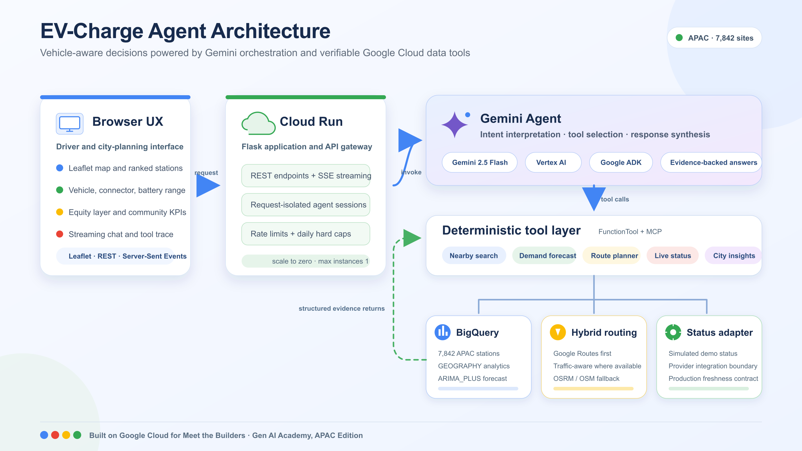

# Building an Explainable EV Charging Agent on Google Cloud: Gemini, BigQuery, and Hybrid Routing

*How I combined Gemini 2.5 Flash, Google ADK, BigQuery geospatial analytics, BigQuery ML, and Cloud Run to turn 7,842 charging locations into vehicle-aware recommendations across Asia-Pacific.*

**Live demo:** https://ev-charge-web-1004528040791.us-central1.run.app

Built for **Meet the Builders — Gen AI Academy, APAC Edition**.

---

## The hard part is not finding a charger

EV drivers already have maps full of charging pins. The difficult question is whether any of those pins is the right decision for the current trip:

> Which charger can my car reach, supports its connector, has acceptable availability, and is unlikely to be congested when I arrive?

That is not a location-search problem. It is a decision problem involving vehicle state, connector compatibility, route feasibility, live conditions, and expected demand.

I built **EV-Charge Agent** to make that decision explicit. A driver selects a vehicle and battery level, chooses an APAC city, and asks for a recommendation in natural language. A Gemini agent then chooses the required tools, evaluates the available evidence, and returns a ranked answer with the factors behind it.

The same data also supports a second audience: city planners deciding where charging infrastructure is missing.

<!-- MEDIUM SCREENSHOT 1 — HERO
Insert here: Full EV-Charge Agent dashboard after selecting Seoul and Hyundai IONIQ 5.
Show: map with ranked charger markers, My EV panel, battery gauge, KPI strip, and chat panel in one frame.
Crop: browser chrome and personal account information; keep the product name and main controls visible.
Suggested caption: EV-Charge Agent combines vehicle state, charging infrastructure, and an AI copilot in one decision interface.
-->

## Why APAC changes the architecture

A single-provider happy path was not enough for this project.

First, charging coverage is uneven. Dense urban districts can have many stations within a few kilometers while nearby neighborhoods remain poorly served. A useful system must expose those gaps instead of optimizing only for drivers who already have good coverage.

Second, connector standards vary by market and vehicle. CCS, CHAdeMO, and Tesla/NACS cannot be treated as interchangeable labels. A nearby charger with the wrong connector is not a weaker recommendation; it is an invalid recommendation.

Third, routing behavior is not uniform across the region. In our deployed tests, Google Routes returned traffic-aware routes for cities such as Tokyo but did not return a usable driving route for Seoul. The application therefore uses Google Routes first and falls back to an OpenStreetMap-based OSRM route when necessary. The user still receives a route instead of an API failure.

These constraints led to a tool-based agent rather than one large prompt.

## What the agent does

The application currently exposes eight tools to a Gemini 2.5 Flash agent built with the Google Agent Development Kit (ADK):

- Search nearby charging stations with geospatial filtering
- Match stations against the selected vehicle connector
- Check current charger status
- Forecast charging demand
- Plan a route and estimate travel distance
- Identify charging-coverage gaps
- Calculate community-impact indicators
- Search charger manuals and troubleshooting guidance

The agent does not call every tool for every question. A nearby-station request may need location search, connector matching, live status, and routing. A city-planning question may instead need coverage analysis and aggregate statistics. ADK provides the orchestration layer, while each tool remains a deterministic and independently testable function.

This separation matters. Gemini interprets the user's intent and chooses the workflow; BigQuery and external services provide the facts.

## Architecture

```text
Browser
  Leaflet map, vehicle selector, battery state, streaming chat
       |
       | REST + Server-Sent Events
       v
Flask application on Cloud Run
       |
       +--> Gemini 2.5 Flash on Vertex AI via Google ADK
       |       |
       |       +--> Function tools and MCP tools
       |
       +--> BigQuery
       |       +--> APAC charging stations (GEOGRAPHY)
       |       +--> charger status and manuals
       |       +--> ARIMA_PLUS demand forecast
       |
       +--> Google Routes API
       |       +--> OSRM/OpenStreetMap fallback
       |
       +--> live-status adapter
               +--> simulated demo data today
               +--> provider integration boundary for production
```

The public application runs on Cloud Run. Chat responses use Server-Sent Events (SSE), allowing the interface to stream both answer tokens and tool-execution events as they occur.



*EV-Charge Agent architecture on Google Cloud, with deterministic tools behind the Gemini orchestration layer.*

## 1. Loading APAC charging data into BigQuery

The data pipeline ingests **7,842 Open Charge Map locations across 13 APAC countries** into a BigQuery table named `ev_charging_stations`.

Each station is stored with a BigQuery `GEOGRAPHY` value alongside connector, power, operator, access, and location metadata. Nearby search uses functions such as `ST_DWITHIN` and `ST_DISTANCE` instead of loading every station into the application process.

Conceptually, the query looks like this:

```sql
SELECT
  station_id,
  title,
  connector_types,
  power_kw,
  ST_DISTANCE(location, user_location) AS distance_m
FROM ev_charging_stations
WHERE ST_DWITHIN(location, user_location, search_radius_m)
ORDER BY distance_m;
```

BigQuery's [`GEOGRAPHY` type and geospatial functions](https://cloud.google.com/bigquery/docs/geospatial-data) keep distance filtering close to the data and make the same station table useful for both driver search and city-level coverage analysis.

The source dataset comes from the [Open Charge Map API](https://www.openchargemap.org/develop/api), an open registry of charging locations. The number 7,842 is the project's ingestion snapshot, not a claim that it represents every charger currently operating in APAC.

## 2. Making the recommendation vehicle-aware

The UI includes seven vehicle profiles and selects a representative default for each demo city. Every profile has a connector type, battery capacity, and estimated range model.

When the battery percentage changes, the application recalculates estimated remaining range and classifies each result as reachable, tight, or out of range. Connector compatibility is applied before ranking.

This creates an important failure mode that the system must report honestly. If a CHAdeMO vehicle has no compatible station within the selected radius, the correct answer is “zero compatible chargers,” not a confident recommendation for an incompatible fast charger.

That negative result is useful information. It is also more trustworthy than silently relaxing a hard constraint.

<!-- MEDIUM SCREENSHOT 3 — VEHICLE-AWARE FILTERING
Insert here: My EV panel beside recommendation cards for a connector-compatibility test.
Show: selected vehicle, connector type, battery percentage, estimated range, and reachable/tight/out-of-range badges.
Preferred scenario: the verified Gangnam CHAdeMO zero-match case, so the UI visibly refuses to recommend an incompatible charger.
Suggested caption: Connector compatibility and remaining range are hard constraints, not cosmetic ranking signals.
-->

## 3. Forecasting congestion with BigQuery ML

Distance alone is a poor ranking signal. The closest charger may be the worst option if demand is about to peak.

The project uses a BigQuery ML `ARIMA_PLUS` model to forecast charging demand. The forecast becomes another input to the recommendation, alongside distance, connector fit, charging power, and availability.

[`ARIMA_PLUS`](https://cloud.google.com/bigquery/docs/reference/standard-sql/bigqueryml-syntax-create-time-series) handles time-series preparation and automatic model selection inside BigQuery. This keeps training and inference close to the operational data and avoids a separate model-serving service for the demo.

There is an important limitation: the current model was trained on the **Gangnam demand zone**. Seoul is therefore the strongest forecasting demo. For other cities, the agent can still use station, connector, routing, and status data, but city-specific congestion predictions require local training data. I surface this as a limitation rather than presenting generalized estimates as equally validated forecasts.

<!-- MEDIUM SCREENSHOT 4 — DEMAND FORECAST
Insert here: Gangnam demand forecast visualization from the live dashboard.
Show: forecast sparkline or chart, forecast time window, and predicted load values; include the related agent recommendation if both remain legible.
Crop: focus on the forecast evidence rather than the full page.
Suggested caption: BigQuery ML ARIMA_PLUS adds expected congestion to distance, power, and connector fit.
-->

## 4. Routing with a regional fallback

The route tool follows a simple provider strategy:

1. Request a traffic-aware route from Google Routes.
2. Validate that the response contains a usable route.
3. If it does not, request a route from OSRM using OpenStreetMap data.
4. Normalize both responses into the same distance, duration, and geometry schema.

This pattern preserves the higher-value Google route when it is available while keeping regional coverage resilient. It also isolates provider-specific behavior inside one tool, so the rest of the agent does not need country-specific branching.

The fallback is based on observed application behavior, not an assumption that one provider has identical feature coverage in every country. Google publishes current feature coverage in the [Routes API coverage documentation](https://developers.google.com/maps/documentation/routes/coverage).

<!-- MEDIUM SCREENSHOT 5 — HYBRID ROUTING
Insert here: Side-by-side route results for Tokyo and Seoul.
Show: Tokyo labeled as Google/traffic-aware and Seoul labeled as the OSM/OSRM fallback, with distance and ETA visible for both.
Crop: use matching map scale and card layout where possible so the provider difference is immediately understandable.
Suggested caption: The routing tool prefers Google Routes and normalizes an OSRM fallback when a usable route is unavailable.
-->

## 5. Showing execution evidence without exposing chain-of-thought

The chat interface includes a live tool-execution trace. Users can see that the agent searched BigQuery, requested a forecast, or planned a route before producing its answer.

This is operational transparency, not a display of Gemini's private chain-of-thought. The interface exposes auditable actions and retrieved evidence:

- Which tools were called
- Which constraints were applied
- Which data contributed to the result
- Why a candidate was accepted or rejected

The final response then summarizes the decision using concrete factors such as reachability, connector compatibility, charging power, current status, and predicted congestion.

For this use case, showing tool activity improved trust more than adding another paragraph of generated explanation. A driver can verify that the answer came from data and services rather than from the language model inventing a plausible station.

<!-- MEDIUM SCREENSHOT 6 — LIVE TOOL TRACE
Insert here: Streaming chat while a charger recommendation is being generated.
Show: the user question, two or more tool-call events, and the final recommendation with its supporting factors.
Crop: keep tool names and evidence readable; exclude any API keys, project identifiers, or developer console details.
Suggested caption: The interface exposes tool execution and retrieved evidence without presenting private model chain-of-thought.
-->

## 6. Reusing the data for community planning

The driver workflow answers, “Where should I charge next?” The planning workflow asks, “Where should the next charger be built?”

The coverage tool analyzes station distance across a geospatial grid and highlights areas that are farther from existing infrastructure. The dashboard also reports aggregate indicators such as station count, public-access share, and an estimated annual CO₂-avoidance metric.

The CO₂ value is explicitly an estimate based on model assumptions, not a measured emissions inventory. Its purpose is to make the impact model visible and comparable, while the charging-desert layer provides the more direct infrastructure signal.

This dual use is the central product idea: one data platform can support an immediate driver decision and a longer-term city investment decision.

<!-- MEDIUM SCREENSHOT 7 — COMMUNITY INTELLIGENCE
Insert here: Equity/charging-desert map with the community KPI strip.
Show: underserved-area overlay, station distribution, public-charger share, and estimated CO₂-avoidance metric.
Crop: keep the map legend and the estimate label visible so the visualization is not presented without context.
Suggested caption: The same geospatial dataset highlights underserved areas and supports city-level infrastructure planning.
-->

## Deployment and cost controls

The web application and agent run in a Cloud Run container. The public demo uses several controls to limit accidental spend and abuse:

- Scale-to-zero behavior when the service is idle
- A maximum of one Cloud Run instance
- Per-IP request limits
- Global daily hard caps for chat, routing, and live-status requests
- BigQuery queries scoped to the required data and geography

The remaining production step is operational rather than architectural: configure project-level budget alerts and explicit daily quotas for the enabled Google Maps APIs before broader promotion.

## What I validated

The deployed application has been tested across the main decision paths:

- Nearby-station search from the BigQuery APAC dataset
- Vehicle connector filtering, including a verified zero-match case
- Reachability updates from vehicle and battery state
- Google routing for Tokyo and OSRM fallback for Seoul
- Streaming Gemini responses with live tool-call events
- Coverage and community-impact views
- Request isolation through a new agent session per chat request

The public demo currently uses simulated availability data. A production system should replace that adapter with verified operator, OCPI/OCPP, or approved provider data and define freshness guarantees for every status value.

## What I learned

### Hard constraints must remain hard

Connector mismatch and insufficient range should not be hidden inside a ranking score. Filter invalid candidates first; rank only the feasible set.

### Regional fallbacks belong in the tool layer

Routing differences are integration concerns. Normalizing providers behind one route tool kept country-specific behavior out of prompts and UI code.

### Tool traces are more useful than vague AI explanations

Users do not need an invented narrative about how a model “thought.” They need to know which systems were queried, what constraints were applied, and which evidence supports the recommendation.

### Limitations increase credibility when they are specific

The current demand model is strongest for Gangnam, and live availability is simulated. Naming those boundaries makes it clear what has been validated and what must change for production.

## Try EV-Charge Agent

Open the **[live demo](https://ev-charge-web-1004528040791.us-central1.run.app)**, choose an APAC city and vehicle, set the battery level, and ask:

> Find a compatible fast charger I can reach, and avoid stations likely to be busy.

EV-Charge Agent was built on Google Cloud for **Meet the Builders — Gen AI Academy, APAC Edition**.
